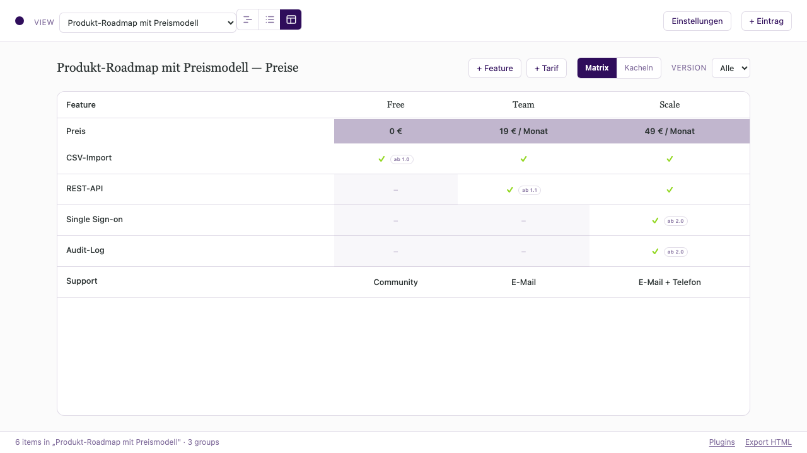

<!-- Generated by scripts/plugins/catalogue.ts — do not edit by hand. -->
<!-- Run `npm run plugins:catalogue` after changing a plugin manifest. -->

# Plugins

What a Zeitlines timeline can carry beyond items and groups. Each plugin adds
item fields, sometimes a view of its own, and sometimes verbs an agent can call.
Its own README is the page that documents it.

Writing one: [docs/plugin-authoring.md](docs/plugin-authoring.md) for the contract,
[docs/plugin-playbook.md](docs/plugin-playbook.md) for the process.

## delivery-planning

### [Sprints](src/plugins/sprints/README.md)

A sprint raster that follows from the dates: which sprint an item is in is computed, not stored, with capacity checks and a forecast on top.

| | |
| --- | --- |
| Id | `dev.zeitlines.sprints` |
| Version | 0.1.0 |
| Keywords | sprint, sprint planning, story points, velocity, capacity, forecast, scrum, self-hosted roadmap |
| Example | [`src:example-sprint-planung`](data/example-sprint-planung.json) |
| Agent tools | `check_sprint_capacity`, `rebalance_sprint`, `forecast_completion` |

## product

### [Produkt](src/plugins/product-roadmap/README.md)

Keeps a pricing matrix and the roadmap that fills it in one timeline, so the pricing page and the plan cannot drift apart.

| | |
| --- | --- |
| Id | `dev.zeitlines.product-roadmap` |
| Version | 1.0.0 |
| Keywords | pricing matrix, pricing page, product roadmap, feature comparison, tiers, release planning |
| Example | [`src:example-produkt-roadmap`](data/example-produkt-roadmap.json) |
| Views | Preise |
