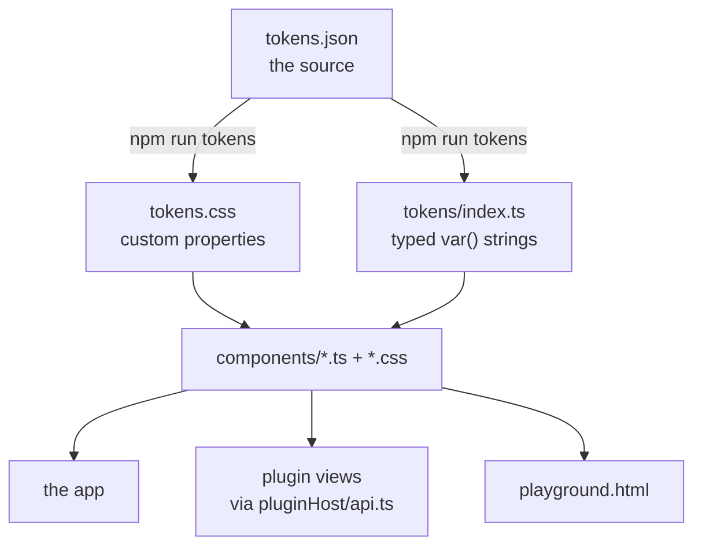

# The design system

Everything the viewer draws comes from one layer: `src/design-system/`. This
chapter is the contract for using it and the reasoning behind its shape. For what
each component is *for*, read the component — the file carries it, next to the
code it explains.

## The contract

**Allowed**

- Colours, spacing, radii and type sizes come from the tokens (`tokens.css`), by
  name.
- Interface is built from the components in `src/design-system/components`.
- A plugin styles its own views with those components and with custom properties
  it defines itself, in one place.

**Forbidden**

- A colour literal anywhere except in a `--custom-property:` declaration.
- A raw px value in `padding`, `margin` or `gap`.
- A `<button>` that is not `Button` or `IconButton`.

**Required**

- A missing variant is added to the component, not worked around at the call
  site.
- A new component appears in the playground.
- Labels, ARIA and a visible focus state, on everything interactive.

The first three of those are checked by
[`scripts/ci/check-design-system.sh`](../scripts/ci/check-design-system.sh) and
fail CI. The exemptions it grants are named in the script with their reasons, and
each is a place where following the rule would produce worse code than breaking
it. Three of them are marks drawn inside the chart (the delete affordance, the
fold caret, the milestone diamond): a `<button>` for the hit area and the
keyboard, with every visual property set by the chart's stylesheet. The list's
fold caret is *not* exempt — it sits in ordinary layout, and it is the
`TreeToggle` component.

**A check that cannot fail is worse than no check.** The spacing rule was dead
from the day it was written until 2026-08: its pipeline ended in `| true` instead
of `|| true`, so every hit was piped into `true` and discarded. The script
reported `ok` with 61 raw values in the tree, 14 of them inside the design system
itself — the layer the rule exists to protect. When adding a rule here, prove it
fails by introducing a violation on purpose, the way the OpenAPI drift test and
the plugin-isolation check were each verified.

Two things the rule deliberately does *not* forgive, because forgiving them is how
it stops meaning anything: a raw value named in a custom property (`--card-pad:
13px` is still not a step on the scale, unlike a colour, where naming the value is
the whole goal), and a per-file exemption. What it does accept is a value derived
with `calc()` from a size token, which is the honest form for the cases where the
number is geometry rather than air — the clearance a heading needs from an
absolutely positioned close button is that button's box plus its inset, so
`calc(var(--control-lg) + var(--space-md))` says why where `44px` only said what.
Where a value genuinely is not spacing, the fix is to stop calling it spacing:
the overrun line's dash pattern became `--overrun-dash-on` / `--overrun-dash-off`,
because the second one had been called a „gap" and read as layout air.

Off-scale values found by that first live run were snapped to **the step below**,
uniformly. Rounding down means no box grows, so nothing outgrew a container or a
`--control-*` height it had been fitted into.

## The three layers



### Tokens

[`tokens.json`](../src/design-system/tokens/tokens.json) is the source; the two
outputs are generated and committed. A stylesheet cannot import JSON, and a
component that needs a token in a style attribute needs it as a value it can
autocomplete — hence both forms. `npm run tokens:check` regenerates into memory
and compares, so a token added without a regeneration fails in CI rather than
shipping as a name nothing defines.

The colour group's names carry no prefix on purpose: `--accent`, `--surface` and
their siblings are the documented theming seam (AGENTS.md → „Theming"), and
renaming them would break every override in the wild.

The glyph sets live beside the tokens in
[`icons.css`](../src/design-system/tokens/icons.css) rather than in the JSON: a
data URL is an asset, not a value on a scale, and twenty of them would bury every
other token.

### Components

One file per component, plus its stylesheet. The anatomy:

```ts
export function Button(options: ButtonOptions = {}): HTMLButtonElement
```

- A factory returning an element. The viewer has no framework, so a component is
  a function.
- One root class, `ds-<Name>`.
- Variants as `data-*` attributes, never as modifier classes. That is what lets a
  stylesheet say `[data-variant='danger']` and a call site read the current
  variant back off the node.
- The stylesheet is imported by the component, so a build carries only the CSS
  for what it renders. That colocation is load-bearing: the plugin bundle-split
  check depends on it.

[`components/index.ts`](../src/design-system/components/index.ts) is the public
API. A component that is not exported there does not exist as far as the rest of
the codebase is concerned.

**Strings.** Two thirds of the call sites in this codebase assemble HTML as text
— the item form's template literals, and vis-timeline, which takes a string per
item and offers no way to hand it a node. Those call sites wrap a component in
`html()`. A component is therefore defined once, as DOM, and the string form is
derived; a `.html()` builder beside every factory would be two definitions of one
component, and the second is where drift starts. What `html()` cannot carry
across is behaviour — a listener does not survive `outerHTML`, and a string call
site wires its own handler after inserting the markup, as it always did.

### The playground

`playground.html` plus [`src/playground/`](../src/playground/): every component,
every variant, on one page. It is a second Vite entry rather than a route,
because the app has no router and because a separate entry keeps the specimens
out of the app's bundle — asserted by
[`check-bundle-split.sh`](../scripts/ci/check-bundle-split.sh), not assumed.

Run `npm run dev` and open `/playground.html`.

## What is *not* in the design system

Three stylesheets survive outside it, and the boundary is worth stating because
it is the one that will be argued about:

| File | What it is |
| --- | --- |
| [`src/styles/timeline.css`](../src/styles/timeline.css) | vis-timeline's own furniture as this app dresses it: `.vis-item`, the item rail, the phase band, the dependency arrows. Not components — a third-party chart's internals. It spends tokens like everything else. |
| [`src/styles/wysiwyg.css`](../src/styles/wysiwyg.css) | The frame around the Markdown editor. What the text inside it looks like is the `Prose` component, which the reading view uses too. |
| [`src/styles/app.css`](../src/styles/app.css) | App composition that is not a component: how the host frames a plugin's view, the timeline switcher, the saved-view rows. The bar is deliberately high, and the file states it at the top — two call sites and it becomes a component. It has drifted past that bar once already and carries a popover surface it should not ([#149](https://github.com/zeitlines/zeitlines/issues/149)). |
| [`src/styles/graph.css`](../src/styles/graph.css) | The „Graph" presentation's chart furniture: the pan/zoom viewport, the band frames, the column heads, the edges. The node box itself is the `GraphNode` component. Same split as `timeline.css`. |
| [`src/styles/members.css`](../src/styles/members.css) | How the „Benutzer" section arranges components it does not own. Imported by `memberAdmin.ts`, so an instance where nobody opens it never downloads it. |
| [`src/styles/settings.css`](../src/styles/settings.css) | The same, for the settings area around it: two columns, and which chrome steps aside while the area is open. Imported by `settingsArea.ts`. |

A plugin's own stylesheet
([`pricing.css`](../src/plugins/product-roadmap/pricing.css)) sits in the same
category: a pricing card is not a generic component, and it should not become
one to satisfy a rule. What the contract asks of it is that its colours are named
and its spacing comes from the scale.

**One thing belongs here and is not here yet: the Markdown editor.**
[`src/wysiwyg.ts`](../src/wysiwyg.ts) is a control the item form uses and plugins
need — it is re-exported from the plugin contract barrel rather than being reached
for, which was the immediate fix (#117). Making it a component is the real one, and
it is a change of its own: it carries a stylesheet and two npm dependencies, and it
would need a playground entry with its empty and error states like everything else
here. Until then, treat its presence on the barrel as a documented exception rather
than as a precedent for exporting app code.

## Plugins

[`src/pluginHost/api.ts`](../src/pluginHost/api.ts) re-exports the whole design
system, so a plugin imports its components from the plugin contract rather than
reaching into the app. That is deliberate: a plugin view is a first-class surface
of the product, so a button in one has to be *the* button.

The design system pulls in no timeline knowledge, which is what keeps that
re-export from turning the contract into a dependency on the viewer.

## What this replaced

Before this layer the viewer was ~3,050 lines of CSS across nine files with DOM
built by hand in each module. The duplication it removed, as a record of what to
watch for:

- **Four popover surfaces** — the filter checklist, the form's pickers, the
  context menu and its submenus — in three stylesheets, already 2px and one
  shadow apart from each other.
- **Five chip editors** (JIRA, tags, dependencies, custom fields, owner) as five
  near-identical blocks joined by comma-separated selectors, and five
  autosuggest dropdowns behind them.
- **Two Markdown stylesheets** describing the same six elements, drifted far
  enough that inline code had a 4px radius while reading and 3px while editing:
  the text visibly moved when you closed the form.
- **Two app shells**, one in `index.html` and one written out by `export.ts`,
  which had drifted in the ways two hand-kept copies do.
- **Seven button treatments** in five stylesheets.
- **`--surface-alt`**, used in six rules and defined in none — every one of them
  silently taking its fallback.
