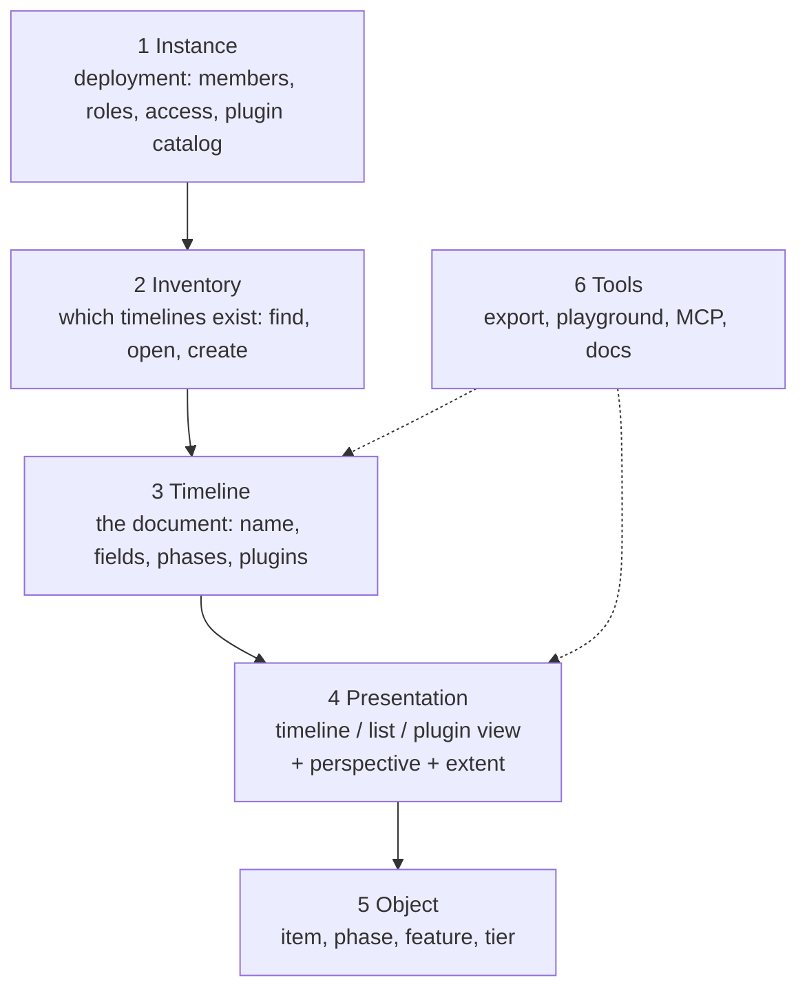

# Information architecture

The levels the product has, what belongs to each, and the rules that decide where
a new control goes.

Part of the Zeitlines documentation; [`AGENTS.md`](../AGENTS.md) holds the index,
the conventions and the commands. References in „quotes" name a section, with its
file when it lives in another chapter.

This chapter is about *where a thing belongs*, not about how it behaves. What each
control does is [`editing.md`](editing.md); what the instance area is,
[`settings.md`](settings.md); what a plugin may add, [`architecture.md`](architecture.md).
The work that follows from it is tracked under
<https://github.com/zeitlines/zeitlines/issues/76>.

## The problem it solves

The interface grew one control at a time, and the header is where that shows: the
instance entry, the timeline picker, the presentation switch, one narrowing
control and the create action sit in a single row as equals. A reader cannot tell
from the row what a click is going to change, the deployment, the document, or the
way the document is drawn.

Two symptoms pin it down, and both are in the code rather than in an opinion:

- **A narrowing control two rows from its siblings.** „Nur Meilensteine" filtered by
  item type and sat in the header, while the filter for every other dimension sat in
  the toolbar below: two controls, two code paths, composed in
  `filterBuildForDisplay`. Fixed by making the type an ordinary filter dimension,
  which first needed a filter that holds more than one of them (see „Filter" in
  [`editing.md`](editing.md)).
- **A class that exists to draw a boundary nothing names.** The header wraps the
  view picker, the presentation switch and the milestones checkbox in
  `.app-timeline-controls`, so the instance area can hide exactly those while it is
  open ([`src/appShell.ts`](../src/appShell.ts)). The boundary between „this steers a
  timeline" and „this is the deployment" was already load-bearing before it had a
  name.

## The six levels

Each level has its own scope, and the scope decides three things: where its state
is stored, whether it has an address, and where it sits on screen.

| Level | Scope | State belongs to | Address today |
| --- | --- | --- | --- |
| 1 Instance | the deployment | server, env, database | `#settings`, `#settings=<section>` |
| 2 Inventory | the deployment | the discovered sources | none |
| 3 Timeline | one timeline | the timeline record | `#view=<id>` |
| 4 Presentation | one timeline, per person | per person and timeline | `#mode=`, `#m=`, `#from=`/`#to=` |
| 5 Object | one object | the object record | `#item=<id>` |
| 6 Tools | varies | nothing | `playground.html` |

**Level 1 already follows this chapter**, and it is the worked example rather than
the exception: `#settings` with the `instance` and `members` sections, a section id
carried verbatim in the hash, each section building its body on mount, the rest of
the hash surviving so closing returns to the timeline the operator left. Level 3
copies that pattern instead of inventing a second one, and the plugin catalog
becomes one more section there. See [`settings.md`](settings.md).

## Level 4 has two halves

The distinction the current interface does not make, and the one everything else
here follows from:

- **The perspective** is how the same set is bundled: today the grouping dimension,
  potentially a sort order or a time scale.
- **The extent** is which subset is visible: the value filter, the milestones
  narrowing, the visible time window.

A presentation is *chosen*, a perspective is *set*, an extent is *narrowed*. Three
different actions, so three places in one bar rather than two controls in the
header and two below it.

The extent is **private and per person**, stored per timeline, and shared by
copying the link (see „Where the display state lives" (docs/editing.md)). Named
extents that everybody sees would be level 3 with a store of their own, and they
are deliberately not part of this.

## Where every control belongs

| Control | Where it is today | Level | What follows |
| --- | --- | --- | --- |
| App mark | header, left | 1 | the entry into the instance |
| „Einstellungen" | header, right | 1 | done: the `#settings` route |
| Access switch, domains, instance profile | env, shown in `#settings=instance` | 1 | done: origin and reason on every row |
| „Plugins" panel | footer | 1 + 3 | the catalog belongs in the instance area; the per-timeline half belongs to level 3. The footer entry stays reachable from a timeline, because that is where „why is this view missing" gets asked |
| View picker | header | 2 | an inventory with search and origin, replacing the flat `<select>` |
| Creating a timeline | nowhere | 2 | needs a create route before it can have an interface |
| Name, description | file or database | 3 | the timeline header and its settings route |
| Custom field definitions | file or database | 3 | timeline settings |
| Enabled plugins and their config | a `timeline_plugins` row | 3 | timeline settings; stays an INSERT |
| Default grouping, `colorBy` | config file | 3 | timeline settings, as the default for level 4 |
| Phases as a set | only the ribbon | 3 | the set is structure of the timeline; one phase is level 5 |
| Presence avatars | header, right | 3 | they belong with the timeline: a session joins per timeline |
| Timeline / list switch | header | 4 | the presentation bar |
| Plugin views | the same switch | 4 | also presentations, but each declaring its own accessories |
| „Gruppieren" | view toolbar | 4, perspective | the presentation bar |
| „Filter" | view toolbar | 4, extent | the presentation bar, beside the other narrowings |
| „Nur Meilensteine" | gone | 4, extent | done: a value of the type dimension in the filter |
| Time window (zoom, pan) | the chart | 4, extent | stays a gesture, counts as extent, travels with it |
| „+ Eintrag" | header, right | 5 | an action of the presentation the object appears in |
| Detail panel, context menu, rail mark | at the object | 5 | they stay: three entrances to one level is right |
| „Export HTML" | footer | 6 | it exports the active presentation with its extent, so it belongs to that presentation |
| Status line | footer | across levels | stays, and loses the action beside it |
| Playground | its own page | 6 | stays outside the product navigation |

Three controls change level, and those are the moves with consequences: „Nur
Meilensteine" into the filter, „+ Eintrag" from the instance row to the
presentation, „Export HTML" out of the status line.

## The rules

The reason this chapter is worth having: each rule decides where a *future*
control goes, so the argument is had once.

- **One level, one place.** A control belongs to exactly one level, and the level
  decides the place. A control that seems to fit two levels is two controls, or it
  is cut wrong.
- **Scope equals storage.** What holds per timeline is stored per timeline; what
  holds per person and timeline is stored under both. A store coarser than the
  scope does not produce a bug, it produces fallback logic: five instance-wide keys
  carried one timeline's filter into the next, and every guard that caught it
  afterwards was that mismatch being paid for. See „Where the display state lives"
  ([`editing.md`](editing.md)).
- **Choosing, setting and doing are separated.** Selectors and state controls on
  one side, actions on the other. The header's `ToolbarGroup` split already draws
  that line; the contents do not respect it.
- **A presentation declares its accessories.** Rather than a flag that switches the
  whole bar off for a plugin view, each presentation states which perspectives and
  extent dimensions apply to it. Otherwise every further plugin view adds another
  special case to the host, and the host is the part that must not know plugin ids.
- **Every level you can link to is in the address.** Levels 3 to 5 are in the hash
  and level 1 has its route; level 2 has no address because it has no surface yet.
  A level without an address cannot be handed to somebody else, which is what
  „send me the link" runs into.

## What the navigation has to provide

Not a layout, just the set of places the levels demand. One each.

- **Levels 1 and 2** share an entry in the header. There is no start page: the app
  opens a timeline, so level 2 is a switcher over the open timeline and level 1 is
  a route behind the same entry.
- **Level 3** needs a header for the open timeline: name, origin, who else is
  looking, the way into its settings. This is the place that does not exist today.
- **Level 4** gets one bar: the presentation switch, the perspective, the extent,
  then the actions on the presentation (create an entry, export). That replaces
  today's split across the header and the view toolbar.
- **Level 5** stays the panel on the right with its two direct entrances at the
  object.
- **Level 6** needs a menu.
- The footer keeps the status line.

Roles show and hide whole levels rather than individual buttons: a `viewer` never
sees level 1, an `editor` sees it without the membership section. That stays an
affordance, with every route enforcing for itself (see [`users.md`](users.md)).

## Decisions

- **No start page.** The app opens a timeline.
- **Timeline settings are a route**, not a panel and not a dialog, so field
  definitions have room and the settings of one timeline can be linked.
- **An extent stays private**, stored per person and per timeline, shared by link.
- **Every presentation declares its accessories**, which retires the `toolbar` flag
  on a plugin view.

## What this leaves alone

- **The `View` type keeps its name.** In the code a `View` is a registered timeline
  with a source (`config.views[]`, `?view=`, `state.activeView`), while the
  interface calls a presentation „Ansicht". The interface gets the clean split
  („Timeline" for the document, „Darstellung" for the presentation); renaming the
  type means migrating the built config, the hash parameter and every stored
  preference, and it earns its own change. Same reasoning as „The name covers the
  product, not its vocabulary or its instances" ([`AGENTS.md`](../AGENTS.md)).
- **Named, shared extents**, per-timeline access rules, and creating a timeline
  from the interface (which needs a create route first).
- **The published hash format.** A new address form is added beside it; the old one
  keeps being read, legacy mode ids included (see „A view is addressable"
  (docs/architecture.md)).
