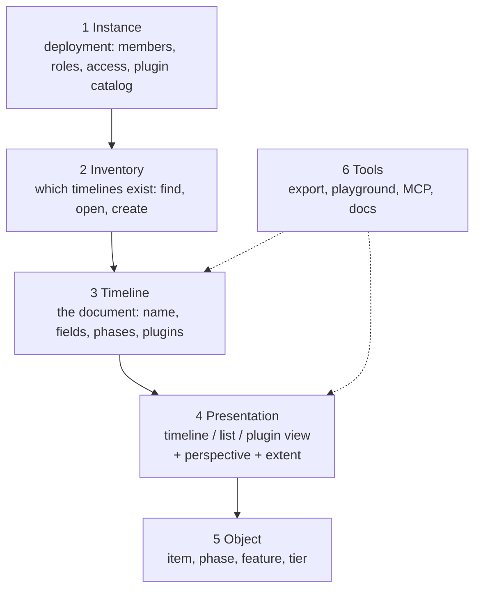

# Information architecture

The levels the product has, what belongs to each, and the rules that decide where
a new control goes.

Part of the Zeitlines documentation; [`AGENTS.md`](../AGENTS.md) holds the index,
the conventions and the commands. References in „quotes" name a section, with its
file when it lives in another chapter.

This chapter is about *where a thing belongs*, not about how it behaves. What each
control does is [`editing.md`](editing.md); what the instance area is,
[`settings.md`](settings.md); what a plugin may add, [`architecture.md`](architecture.md).
The work that follows from it is tracked under
<https://github.com/zeitlines/zeitlines/issues/76>.

## The problem it solves

The interface grew one control at a time, and the header is where that shows: the
instance entry, the timeline picker, the presentation switch, one narrowing
control and the create action sit in a single row as equals. A reader cannot tell
from the row what a click is going to change, the deployment, the document, or the
way the document is drawn.

Two symptoms pin it down, and both are in the code rather than in an opinion:

- **A narrowing control two rows from its siblings.** „Nur Meilensteine" filtered by
  item type and sat in the header, while the filter for every other dimension sat in
  the toolbar below: two controls, two code paths, composed in
  `filterBuildForDisplay`. Fixed by making the type an ordinary filter dimension,
  which first needed a filter that holds more than one of them (see „Filter" in
  [`editing.md`](editing.md)).
- **A class that exists to draw a boundary nothing names.** The header wraps the
  view picker, the presentation switch and the milestones checkbox in
  `.app-timeline-controls`, so the instance area can hide exactly those while it is
  open ([`src/appShell.ts`](../src/appShell.ts)). The boundary between „this steers a
  timeline" and „this is the deployment" was already load-bearing before it had a
  name.

## The six levels

Each level has its own scope, and the scope decides three things: where its state
is stored, whether it has an address, and where it sits on screen.

| Level | Scope | State belongs to | Address today |
| --- | --- | --- | --- |
| 1 Instance | the deployment | server, env, database | `#settings`, `#settings=<section>` |
| 2 Inventory | the deployment | the discovered sources | none |
| 3 Timeline | one timeline | the timeline record | `#view=<id>`, `#timeline-settings=<section>`, `#sv=<id>` |
| 4 Presentation | one timeline, per person | per person and timeline | `#mode=`, `#m=`, `#from=`/`#to=` |
| 5 Object | one object | the object record | `#item=<id>` |
| 6 Tools | varies | nothing | `playground.html` |

**Level 1 already follows this chapter**, and it is the worked example rather than
the exception: `#settings` with the `instance` and `members` sections, a section id
carried verbatim in the hash, each section building its body on mount, the rest of
the hash surviving so closing returns to the timeline the operator left. Level 3
copies that pattern instead of inventing a second one, and the plugin catalog
becomes one more section there. See [`settings.md`](settings.md).

## Level 4 has two halves

The distinction the current interface does not make, and the one everything else
here follows from:

- **The perspective** is how the same set is bundled: today the grouping dimension,
  potentially a sort order or a time scale.
- **The extent** is which subset is visible: the value filter, the milestones
  narrowing, the visible time window.

A presentation is *chosen*, a perspective is *set*, an extent is *narrowed*. Three
different actions, so three places in one bar rather than two controls in the
header and two below it.

The extent is **private and per person**, stored per presentation of a timeline, and
shared by copying the link (see „Where the display state lives" (docs/editing.md)).
Both halves of it are in that link now: the window as `from`/`to`, the filter as `f`
(„URL state", docs/editing.md). It was a half-truth for a while — the sentence
promised a shareable extent while only the window travelled — which is the kind of
claim a chapter makes and the code quietly does not keep.

**A named bundle of the two is level 3**, because it is stored with the document
and can be somebody else's to read: that is what a saved view („Ansicht") is, and
it has the store of its own this chapter said it would need — see „Gespeicherte
Ansichten" (docs/editing.md). It does not change where the unnamed extent lives.
The control sits at the head of the perspective/extent group in the level 4 bar,
which is the one place a level-3 object appears among level-4 controls: it is a
shortcut over exactly those two, and putting it anywhere else would mean reaching
for a different part of the screen to set the same thing.

## Where every control belongs

| Control | Where it is today | Level | What follows |
| --- | --- | --- | --- |
| App mark | header, left | 1 | the entry into the instance |
| „Einstellungen" | the header menu | 1 | done: the `#settings` route, reached from the menu at the trailing edge rather than from a button in the row. Offered on a `manage` role, or to anybody where no access control runs — gating it on a role nobody can hold hid the one page that says so |
| „Abmelden" | the header menu | 1 | done: `/auth/logout` had existed in the auth gate from the start with nothing pointing at it. Offered only where a session exists, which only the gate can report |
| Access switch, domains, instance profile | env, shown in `#settings=instance` | 1 | done: origin and reason on every row |
| „Plugins" panel | footer | 1 + 3 | the catalog belongs in the instance area; the per-timeline half belongs to level 3. The footer entry stays reachable from a timeline, because that is where „why is this view missing" gets asked |
| Timeline switcher | header, left | 2 | done: search, grouped by origin, the open one marked; the trigger doubles as the statement of which timeline is open |
| Creating a timeline | nowhere | 2 | needs a create route before it can have an interface |
| Name, read-only state | header, left | 3 | done: the name with no caption in front of it, and a „Nur lesend" badge only where something is missing. The origin is the switcher's group heading, so a badge repeating it was the same word twice |
| Custom field definitions | the timeline settings route | 3 | done: `#timeline-settings=fields` |
| Enabled plugins and their config | a `timeline_plugins` row | 3 | timeline settings; stays an INSERT |
| Name, description, default grouping | the timeline settings route | 3 | done: `#timeline-settings=general`, written through `PATCH /api/source/<id>` |
| Phases as a set | only the ribbon | 3 | the set is structure of the timeline; one phase is level 5 |
| Presence avatars | header, trailing edge | 3 | they belong to the open timeline and sit with the instance controls anyway: exactly one timeline is ever open, so no position in this bar can name the wrong one, and the trailing edge is where every other tool puts the people on a document |
| Darstellung switch (Timeline / Liste / Graph) | the bar | 4 | done: first in the bar, since a presentation is what you choose first |
| Plugin views | the bar, one control per plugin | 4 | done: each plugin's views sit in its own control, its name inside on the left; the control marks itself while one of its views is active |
| „Gruppieren" | the bar | 4, perspective | done |
| „Filter" | the bar | 4, extent | done: beside the switch, holding every narrowing, and travelling in the link as `f` |
| „Ansicht" (saved views) | the bar, first of its group | 3 | done: a named bundle of the presentation, the perspective and the extent, stored with the timeline and shareable with the instance. A **mark** rather than a labelled control: the bar wraps below ~1000px with a plugin present, and a third caption moved that to ~1200px |
| „Nur Meilensteine" | gone | 4, extent | done: a value of the type dimension in the filter |
| Time window (zoom, pan) | the chart | 4, extent | stays a gesture, counts as extent, travels with it |
| „+ Eintrag" | the bar, right | 5 | done: an action of the presentation the object appears in, offered only where it can appear |
| Detail panel, context menu, rail mark | at the object | 5 | they stay: three entrances to one level is right |
| „Export HTML" | the bar, right | 6 | done: it exports the active presentation with its extent, so it sits with it |
| Status line | footer | across levels | done: the footer holds the count and the plugin diagnostic, no actions on the timeline |
| Playground | its own page | 6 | stays outside the product navigation |

Three controls changed level, and those were the moves with consequences: „Nur
Meilensteine" into the filter, „+ Eintrag" from the instance row to the
presentation, „Export HTML" out of the status line. All three have landed.

**The bar is never hidden**, because it carries the switch: hiding it in a plugin
view would strand whoever is in one with no way back. Only the controls that do not
apply go, and „applies" is what the presentation declares — including whether
creating an item and exporting make sense there, which they do not in a view that
shows something else.

## The rules

The reason this chapter is worth having: each rule decides where a *future*
control goes, so the argument is had once.

- **One level, one place.** A control belongs to exactly one level, and the level
  decides the place. A control that seems to fit two levels is two controls, or it
  is cut wrong.
- **Scope equals storage.** What holds per timeline is stored per timeline; what
  holds per person and timeline is stored under both. A store coarser than the
  scope does not produce a bug, it produces fallback logic: five instance-wide keys
  carried one timeline's filter into the next, and every guard that caught it
  afterwards was that mismatch being paid for. See „Where the display state lives"
  ([`editing.md`](editing.md)).
- **Choosing, setting and doing are separated.** Selectors and state controls on
  one side, actions on the other. The header's `ToolbarGroup` split already draws
  that line; the contents do not respect it.
- **A presentation declares its accessories.** Rather than a flag that switches the
  whole bar off for a plugin view, each presentation states which perspectives and
  extent dimensions apply to it. Otherwise every further plugin view adds another
  special case to the host, and the host is the part that must not know plugin ids.
  This holds for the **built-in** presentations too, and the graph is what proved
  it: „built-in" had been shorthand for „a rendering of the item list, so all four
  apply", and the first built-in presentation that is not one would otherwise have
  inherited an export action it cannot perform.
- **A control states its behaviour at N, and where N is owned by installed plugins,
  N decides the form.** This chapter assigned every control a level and never asked
  how many of each there would be, which is how the presentation switch ended up with
  17 segments on an instance with five plugins: 34px each for labels needing 90, and
  icon-only segments, so fifteen indistinguishable squares. A fixed-width row is the
  wrong container for a count somebody else decides. What replaced it — one labelled
  control per plugin — moves the limit rather than removing it, which is exactly why
  the rule is about *stating* the behaviour rather than about a particular form.
- **Every level you can link to is in the address.** Levels 3 to 5 are in the hash
  and level 1 has its route; level 2 has no address because it has no surface yet.
  A level without an address cannot be handed to somebody else, which is what
  „send me the link" runs into.

## What the navigation has to provide

Not a layout, just the set of places the levels demand. One each.

- **Levels 1 and 2** are both in the header and at opposite ends of it. There is no
  start page: the app opens a timeline, so level 2 is the switcher over the open
  timeline, at the leading edge beside the logo. Level 1 is a menu at the trailing
  edge holding „Einstellungen" and „Abmelden", each offered only where it applies:
  „Einstellungen" to a role that may `manage`, or to anybody on an instance that
  runs no access control at all, since the area's content is then the sentence
  saying so (see „The cost of gating it on `manage`" in [`settings.md`](settings.md));
  „Abmelden" wherever a session exists, which only the auth gate can report.

  It is a menu rather than a button because level 3 needs a gear of its own, and
  two settings entries in one row told apart only by where they sit is not a
  distinction anybody makes at a glance. The row is not the place for „Konto"
  either: there is no account surface, and a heading over an empty one would be
  inventing a level rather than naming it.

  **The trigger is always on screen, and the empty case says so in a row.** Hiding
  the trigger when neither action applies was the first shape of this and it reads
  well until you notice which instances it hides on: an ungated one has no role to
  administer with and no session to end, which is every instance this is developed
  on. The menu was then invisible precisely where somebody goes looking for it.
  What an empty menu must not be is an empty popover, which reads as a failed load
  rather than as an answer.
- **Level 3** needs a header for the open timeline: name, origin, who else is
  looking, the way into its settings. The name leads, with nothing written in front
  of it, and the gear that opens `#timeline-settings=<section>` sits directly against
  it — the same section pattern the instance area uses, from one shared frame
  (`src/areaFrame.ts`). Who else is looking is at the trailing edge. The origin has
  no element of its own here: the switcher groups its list under „Datenbank" and
  „Lokal", so a badge saying the same word beside the name was that word twice and
  pushed the name and its gear apart. What survives of it is the read-only badge,
  which says the one thing nothing else does.

  The three defects that cost this row half again its height are worth keeping in
  view, because each is a way a bar decays: a wrapper element with no layout on it
  (the avatar stack, a block-level flex container, dropped onto a second line), a
  caption naming the *type* of a thing already named („TIMELINE" in front of a
  timeline's name), and one control carrying two unrelated facts so that neither can
  be dropped when only one applies.
- **Level 4** gets one bar: the presentation switch, the perspective, the extent,
  then the actions on the presentation (create an entry, export). That replaces
  today's split across the header and the view toolbar.
- **Level 5** stays the panel on the right with its two direct entrances at the
  object.
- **Level 6** needs a menu.
- The footer keeps the status line.

Roles show and hide whole levels rather than individual buttons: a `viewer` never
sees level 1, an `editor` sees it without the membership section. That stays an
affordance, with every route enforcing for itself (see [`users.md`](users.md)).

## Decisions

- **No start page.** The app opens a timeline.
- **Timeline settings are a route**, not a panel and not a dialog, so field
  definitions have room and the settings of one timeline can be linked.
- **An extent stays private**, stored per person and per presentation, shared by link —
  the whole of it, window and filter both.
- **Every presentation declares its accessories**, which retires the `toolbar` flag
  on a plugin view.

## What this leaves alone

- **The `View` type keeps its name, the interface does not.** In the code a `View` is
  a registered timeline with a source (`config.views[]`, `?view=`,
  `state.activeView`); the interface now says **Timeline** for that document and
  **Darstellung** for the way it is drawn, and no longer spends „Ansicht" on the
  second while the code spends `View` on the first. The freed word now names the
  saved combination of presentation, perspective and extent (code: `SavedView`),
  which is a different object from either and the one people already call an
  „Ansicht". Renaming the type would mean
  migrating the built config, the hash parameter and every stored preference, so it
  earns its own change — same reasoning as „The name covers the product, not its
  vocabulary or its instances" ([`AGENTS.md`](../AGENTS.md)). The mapping, for
  whoever reads both: interface „Timeline" = `View` + its `TimelineFile`; interface
  „Darstellung" = `ViewMode` (`timeline`, `list`, `plugin:<id>:<view>`).
- Per-timeline access rules, and creating a timeline from the interface (which
  needs a create route first). **Named, shared extents used to be on this list**
  and are now „Gespeicherte Ansichten" (docs/editing.md).
- **The published hash format.** A new address form is added beside it; the old one
  keeps being read, legacy mode ids included (see „A view is addressable"
  (docs/architecture.md)).
