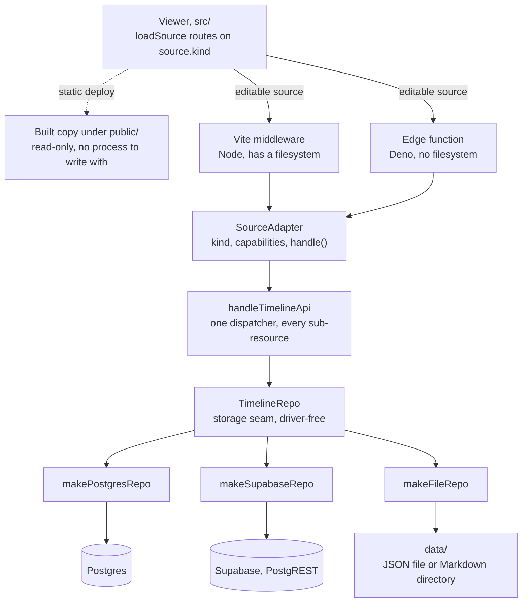
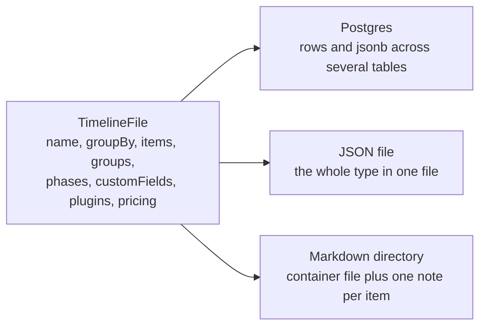

# Overview

How the pieces fit together. Every other chapter is thorough about one subsystem;
this one is the map between them, and it is the place to start.

Part of the Ganttry documentation; [`AGENTS.md`](../AGENTS.md) holds the index,
the conventions and the commands. References in „quotes" name a section, with
its file when it lives in another chapter.

Two figures carry most of this document: the path a request takes through the
layers, and the way one type is laid out across three different stores. Both are
drawn as **seams and layers**, deliberately. Interfaces and the boundaries
between them change rarely; the functions behind them change constantly, so a
figure that enumerated them would be wrong within a month.

## The request path

Four things are worth reading off that figure.

**The client never probes.** Which of the two paths out of the viewer applies is
decided before runtime: a DB source is always served live, and a local source
carries `editable` stamped in at build time, because the build is what knows
which of the two runtimes it is producing for. A failure to reach the API
surfaces loudly instead of quietly dropping to the built copy. The reasoning is
in „Source kinds (adapters)" ([`architecture.md`](architecture.md)) and the rule
behind it is „No fallback data, ever" ([`AGENTS.md`](../AGENTS.md)): a stale copy
is indistinguishable from real data and reliably gets mistaken for it.

**Both runtimes meet at the same seam.** The Node middleware and the Deno edge
function each parse their own native request, then resolve a `SourceAdapter` and
dispatch through it. Neither one contains storage logic, so a status code or a
locking rule exists once rather than twice.

**One dispatcher serves every sub-resource.** `handleTimelineApi` owns the routes,
the status codes and the optimistic-locking semantics for all sources. That is
why the local file source is a third `TimelineRepo` implementation rather than a
dispatcher of its own: it inherits every route and both shared validations
without restating them.

**The seam is driver-free on purpose.** [`repo.ts`](../scripts/db/repo.ts) imports
only types, so pulling it in never drags a database driver into a bundle. The
Deno edge bundle depends on that, and
[`edge-imports.test.ts`](../scripts/ci/edge-imports.test.ts) guards the import
graph against a regression.

## One type, three layouts

A timeline is one type, `TimelineFile` in [`src/types.ts`](../src/types.ts).
Nothing downstream of a repo knows which store it came from.

| Part of `TimelineFile` | Postgres | JSON file | Markdown directory |
| --- | --- | --- | --- |
| `name`, `description`, `groupBy` | columns on `timelines` | top-level keys | `timeline.json` |
| `items[]` | one row per item in `timeline_items` | an array in the same file | one `.md` per item, in frontmatter |
| `groups[]` | `timeline_groups` | an array | `timeline.json` |
| `phases[]` | `timelines.phases`, jsonb | an array | `timeline.json` |
| `customFields[]` | `timelines.custom_fields`, jsonb | an array | `timeline.json` |
| `plugins[]` | one row per plugin in `timeline_plugins` | an array | `timeline.json` |
| `pricing` | the `pricing_*` tables | an object | not supported, answered with `501` |
| the version behind `If-Match` | a `version` column, maintained by trigger | the file's mtime | the directory's mtime |

Three consequences follow from that table.

**Granularity differs, semantics do not.** Postgres stores an item as a row and
can therefore lock and update it individually; a JSON file is rewritten whole.
Both honour the same `If-Match` contract, because the file repo derives a version
from the file's mtime and forces it strictly forward on every write, so two edits
inside one millisecond cannot share a version.

**The container file is its own type.** A directory source has no `items` in its
`timeline.json`, so it is typed as `TimelineContainer` rather than as a
`TimelineFile` with an optional `items`. Making `items` optional would push a
guard into every call site that iterates it, none of which ever sees a container
file. See [`data-model.md`](data-model.md) and
[`local-sources.md`](local-sources.md).

**A store may decline.** `NotSupportedError` maps to `501` and means the caller
and the request are both fine while this particular backing store cannot do it.
Reporting a silent success instead would let the interface say „Gespeichert" for a
write that never happened.

## The other axis: plugins

Source kinds decide *where* a timeline's data comes from. Plugins decide *what* a
timeline carries beyond items and groups, and the two are orthogonal: any plugin
works on any source kind, subject to that store supporting the data it needs.

Enablement is pure data, a row in `timeline_plugins` surfaced as
`TimelineFile.plugins`, so enabling a plugin is an INSERT rather than an
`ALTER TABLE`. On the client, `src/pluginHost/` is the permanent core and
`src/plugins/<id>/` holds the plugins themselves, loaded through a dynamic
`import()` so a build without a plugin ships neither its code nor its stylesheet.

The full account, including the versioned contract and the accepted first-cut
deviations, is „Plugins" in [`architecture.md`](architecture.md). How to build one
is [`plugin-playbook.md`](plugin-playbook.md).

## Where to go next

| Question | Chapter |
| --- | --- |
| What are the extension seams, in detail? | [`architecture.md`](architecture.md) |
| What does a timeline file look like? | [`data-model.md`](data-model.md) |
| What does an item carry beyond dates? | [`items.md`](items.md) |
| How does editing behave in the interface? | [`editing.md`](editing.md) |
| Schema, drivers, locking, live updates | [`database.md`](database.md) |
| A JSON file or a directory of Markdown as the source | [`local-sources.md`](local-sources.md) |
| The HTTP API | [`../openapi.yaml`](../openapi.yaml) |
