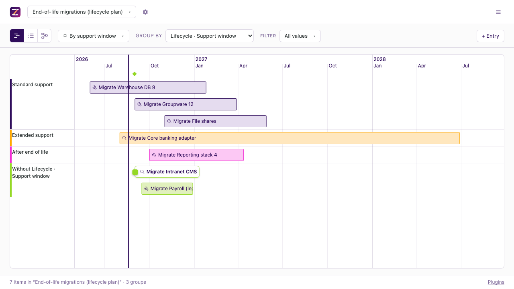

# Lifecycle

## What does it do?

It dates a migration backwards from the day a vendor stops supporting the system.
End of support is the one date on the plan that nobody on the project controls, so
this plugin treats it as the fixed point and computes the rest from it: the latest day
work can still start, a cutover that avoids the organisation's freeze windows, and a
parallel run that keeps whatever minimum the timeline sets. Three verbs let an agent
apply those rules; two computed fields put the answers on every item.

## Who is it for?

A team that has been handed a date by somebody else and has to work backwards from it:
an operating system going out of support, a vendor discontinuing a product, a contract
that ends. It is worth switching on when the plan has more than one such system and the
question „which of these is already late" cannot be answered by looking.

## How do I see it?

The committed example is [`data/example-eol-migration.json`](../../../data/example-eol-migration.json),
seven systems with every state the rules distinguish. Group by **Lifecycle · Support
window** and the plans that end past their own end of life separate out.



## How do I switch it on?

There is no interface for enabling a plugin yet
([#85](https://github.com/zeitlines/zeitlines/issues/85)), so it is one of two places.

In a local timeline file, an entry in `plugins`:

```json
{
  "plugins": [
    {
      "id": "dev.zeitlines.lifecycle",
      "public": true,
      "config": { "minParallelRunDays": 30, "defaultLeadTimeDays": 180 }
    }
  ]
}
```

On a database timeline, the `configure_plugin` MCP tool with the same config.

`"public": true` is only needed to publish the freeze windows on a static deploy;
without it the rows are stripped from the build and the cutover rules have no calendar
to avoid.

### What does the config mean?

| Key | What it is |
| --- | --- |
| `minParallelRunDays` | Shortest parallel run the plan may have. **No default** — without it the cutover and risk rules report that they cannot answer. |
| `defaultLeadTimeDays` | Lead time for an item that names none. Absent rather than defaulted, for the same reason. |

Neither has a default because the practice has no industry-wide number. The sources
disagree by an order of magnitude: two to four weeks, fifteen days to three months, two
to eight weeks, and „a full business year" before the old system goes off. Picking one
here would be this plugin inventing a domain rule and every plan inheriting it silently.

## What fields does it add?

Six a person fills in, two the plugin computes. Every date is `YYYY-MM-DD` and is
refused in any other shape — `14.10.2026` accepted here would be read as an American
date and put every computed date months from where the author meant it.

| Key | Label | Type | Where the value comes from |
| --- | --- | --- | --- |
| `system` | System | text | typed. Which system this entry is about |
| `endOfSupport` | End of support | text | the vendor's lifecycle page |
| `extendedUntil` | Extended support until | text | typed, when extended support was actually bought |
| `leadTimeDays` | Lead time (days) | text | typed, or the config's default |
| `cutover` | Cutover | text | typed, or written by `plan_cutover` |
| `shutdown` | Shutdown | text | typed, or written by `plan_cutover` |
| `latestStart` | Latest start | text, **computed** | the deadline minus the lead time |
| `supportWindow` | Support window | select, **computed** | which window the shutdown falls in |

The two computed fields are stored nowhere and recomputed on every build. That is
deliberate rather than an optimisation: a copy of „inside standard support" survives the
item moving, and a stale answer there is indistinguishable from a true one.

`supportWindow` has three values — `standard`, `extended`, `unsupported` — measured at
the **shutdown** date, falling back to the cutover. That is the day the question is
about: „will this still be supported when we finally switch it off" is what a migration
plan is trying to answer, and measuring at the start would report every plan as safe on
the day it was written.

## What can my agent do with it?

| Verb | What it changes | Which rule it applies |
| --- | --- | --- |
| `plan_cutover` | writes `cutover` and `shutdown` on one item | the old system is off by the deadline, the parallel run before it is at least the minimum, and the cutover is moved **earlier** out of any freeze window |
| `check_eol_risk` | nothing | every rule at once, reported per system |
| `shift_out_of_freeze` | writes `cutover` on every affected item | the cutover moves forward to the first admissible day; the shutdown stays put |

Three things worth knowing before calling them.

**`plan_cutover` moves a blocked cutover earlier, not later.** Later would trade away
the parallel-run minimum it was just given; earlier lengthens the run. It refuses, with
the reason, when there is no end-of-support date, no configured minimum, or when the
freeze windows leave no admissible day before the item's own start.

**`shift_out_of_freeze` leaves the shutdown where it is.** Moving it along would keep
the parallel run intact and push the old system past the vendor's date, which is the one
date nobody can negotiate. So the freeze costs parallel-run time, and the verb's job is
to say exactly how much and which plans drop under the minimum.

**`check_eol_risk` reports what it cannot judge as loudly as what is wrong.** An item
with no vendor date and an item with a sound plan are different answers, and a verb that
listed only failures would report „no risks" for a timeline nobody has filled in yet.

## How well is this domain modelled?

| Part | Confidence |
| --- | --- |
| The arithmetic: latest start, parallel-run length, freeze overlap, next admissible day | **Verified.** Every boundary has a test, including a cutover already inside a window, a window longer than the time that is left, and an end-of-support date in the past. |
| Standard → extended → end of life as an order | **Plausible**, and sourced. |
| What extended support *is*, how long it lasts, whether it can be bought | **Not modelled at all**, on purpose. |

That last row is the important one. The clearest source found says it outright: neither
term has a universal industry definition, so what a vendor still provides has to be
confirmed per vendor. So the plugin takes **two dates as input** and derives no second
date from the first. It will never compute „extended support runs three years past end of
support", because that rule does not exist.

### Open questions

These are the gaps a practitioner would close, and they are the concrete way in:

- Does a freeze window block the whole cutover-to-shutdown span, or only the cutover
  day? This plugin blocks only the cutover.
- Is the minimum parallel run a property of one system or of the organisation? It is
  configured per timeline here.
- Does bought extended support move the latest start, or is „we bought a year" a separate
  risk decision that should not silently relax the deadline? It moves it here.
- Should hypercare after the cutover be its own span, given that the sources treat the
  freeze as running until hypercare ends rather than until the cutover?

## How do I improve it?

The four questions above are the useful place to start, and none of them needs new
plumbing: each is a rule in [`lifecycle.ts`](lifecycle.ts) with its test beside it. If
you run migrations for a living and one of the answers above is wrong, that is the
contribution worth making — see [`CONTRIBUTING.md`](../../../CONTRIBUTING.md), and
[`AGENTS.md`](AGENTS.md) in this folder for what must not be renamed.

## How does it compare?

The category is lifecycle and obsolescence risk, and the nearest thing with sourced
facts is **SAP LeanIX**: it aggregates lifecycle data across an application portfolio,
tells you where each component sits in its lifecycle from the manufacturer's own data,
and shows end-of-life risk across the estate
(<https://www.leanix.net/en/products/technology-risk-and-compliance>, read 2026-08-18).

That is a different question from this one. A portfolio tool answers „which of my
hundreds of applications is at risk"; it starts from an inventory it maintains for you.
This plugin answers „does *this* plan still fit before *this* date", starting from dates
you type, on a timeline you already have. It ships no inventory and no vendor dates at
all, deliberately: a committed list of real end-of-support dates would be stale the week
after it was written, and a stale date here produces a plan that looks sound.

### Terminology

The reader's word wins for anything visible.

| The common word | Where it is used | Note |
| --- | --- | --- |
| end of support, EOL | field label, keywords | both spellings are in the keywords, because the vendors' own pages disagree about which they mean |
| cutover | field label, verb name | unchanged in German („Cutover", „Go-Live") |
| freeze window | collection, verb name | German practice says „Freeze", „Wartungsfenster", „Blackout" |
| parallel run | rule, this page | German „Parallelbetrieb" |
| shutdown | field label | German „Abschaltung" |

Core vocabulary is unchanged: an **item** is one system's migration, a **group** is
whatever lane the timeline uses. This plugin claims neither.

## Where do the questions on this page come from?

The vocabulary above was harvested from search results in English and German on
**2026-08-18**, not invented while writing the code. The questions people actually ask,
with what currently answers them:

| Question | Language |
| --- | --- |
| How much lead time before end of life do we need? | EN |
| What is the latest we can start and still make the deadline? | EN |
| What is the difference between end of life, end of support and extended support? | EN |
| How long should the parallel run be before we switch the old system off? | EN/DE |
| What do we do when the cutover lands in a change freeze? | EN/DE |
| Wann müssen wir mit der Migration anfangen? | DE |

What the pages currently answering these all omit is the same thing: they say „plan
twelve to twenty-four months ahead" and none of them computes a date. That is the gap
this plugin fills.

**No search-volume figure appears on this page**, because no tool with volume data was
available. Result counts and autocomplete are proxies and are not demand.

### Measurement log

| Date | What was recorded |
| --- | --- |
| 2026-08-18 | Questions harvested. **Baseline not measured**: only one model was reachable, and a baseline of one is not a baseline. Phase 6 of the playbook is therefore skipped explicitly rather than compared against an estimate. |

## Example

[`data/example-eol-migration.json`](../../../data/example-eol-migration.json) — seven
systems, two freeze windows, a 30-day minimum parallel run. The systems are invented;
see „How does it compare?" for why no real vendor dates ship here.
