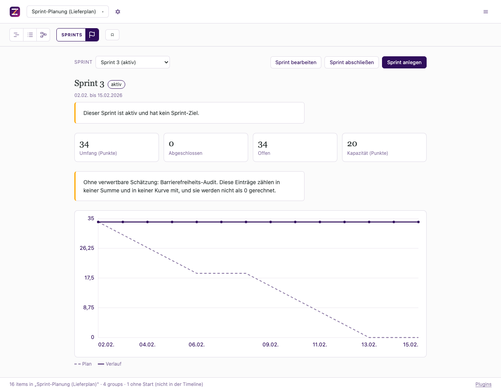

# Sprints

## What does it do?

It gives a timeline sprints as things of their own: a sprint has a **goal**, a window,
a state and a capacity, and items are **assigned** to it. On top of that it draws a
burndown, keeps the history of which sprints an item passed through, and hands an agent
three verbs: assign work, roll unfinished work over to an explicit target, report a
sprint with every warning its data produces.

The cadence has not gone away, it has been demoted to what it is: a **suggestion**. A
second, computed field says which sprint an item's dates fall into, so the timeline's
own axis stays useful for planning while the assignment remains the commitment. Where
the two disagree, the plugin says so and changes neither.

## Who is it for?

A team that runs sprints and keeps a roadmap on the same dates, and is tired of
answering „which sprint is this in" twice: once in the tracker and once on the plan.

The first cut of this plugin computed the sprint from an item's start date and stored
nothing. That was wrong in the domain and is worth saying out loud, because the
correction is the plugin's whole shape: the Scrum Guide makes the Sprint Backlog a
*selection*, and of six products checked (Jira, Azure DevOps, Linear, GitHub Projects,
YouTrack, OpenProject) not one derives membership from dates. The full reasoning, with
sources, is in [`docs/model.md`](docs/model.md).

## Where can you see it?

The committed example is [`data/example-sprint-planung.json`](../../../data/example-sprint-planung.json):
sixteen items across four tracks, five sprints (two closed with a frozen report, one
active without a goal, two planned), and one item deliberately assigned to a sprint
whose window its dates fall outside. Open the **Sprint** presentation for a sprint's own
page; the saved views „Nach Sprints" and „Nach Datum" group the timeline by the
assignment and by the suggestion.



## How do you switch it on?

There is no interface for enabling a plugin yet
([#85](https://github.com/zeitlines/zeitlines/issues/85)), so it is an MCP call or a
line in the file. On a database timeline the verb is `configure_plugin` on the local
stdio server (`npm run mcp`) and `enable_plugin` on a deployed instance, which is the
same operation under two names. In a local file it is an entry in `plugins`:

```json
{
  "plugins": [
    {
      "id": "dev.zeitlines.sprints",
      "config": { "start": "2026-01-05", "lengthDays": 14, "velocity": 20 }
    }
  ]
}
```

| Config key | Meaning | Default |
| --- | --- | --- |
| `start` | anchor date of sprint 1, `YYYY-MM-DD` | required; without it the plugin contributes nothing |
| `lengthDays` | sprint length in days, fixed for every sprint | `14` |
| `velocity` | story points a sprint is expected to hold | absent = the capacity and forecast verbs answer that they cannot answer. A value below `0.01` is refused by the config schema rather than stored, because it rounds to zero at the resolution every verdict compares at |
| `scale` | the estimate options offered | `["1","2","3","5","8","13","21"]` |

## What fields does it add?

| Key | Label | Type | Where the value comes from |
| --- | --- | --- | --- |
| `sprint` | Sprint | select | **the assignment.** Chosen, stored, options are the sprint rows (values are their ids, so renaming a sprint orphans nothing) |
| `sprintByDate` | Sprint nach Datum | select, **derived** | the suggestion: the sprint whose window contains the item's start. Read-only, never stored |
| `storyPoints` | Story Points | select | chosen; options from `scale` |
| `estimateConfidence` | Confidence | select (hoch, mittel, niedrig) | chosen |

Two fields for one question, on purpose. „Which sprint did we commit this to" and
„which sprint do its dates fall into" are different questions, and a plugin that
answered only one of them would either lose the commitment or lose the plan. Both are
grouping dimensions, so the disagreement is visible in one click rather than hidden in
a rule.

**The assignment wins wherever a number is computed**, and a disagreement is reported,
never resolved: moving the item's dates would edit a plan somebody made, moving it out
of the sprint would edit a commitment somebody made.

Three boundaries the suggestion has to hold, and each is a test:

- an item **without a start** has no sprint and lands in the empty bucket, which the
  interface names „Ohne Sprints · Sprint" (the core qualifies a plugin's dimension with
  the plugin name, so „Sprints · Sprint" is the dimension and this is its „Ohne …");
- an item starting **before the anchor** has no sprint either, rather than a
  „Sprint 0";
- an item **spanning several sprints** belongs to the one its start falls into. That
  keeps one item in one lane and lets the capacity sum count it exactly once. It also
  means a long item is absent from the sprints it runs through, which is the trade
  and is question 1 below.

## What data does it keep?

Three collections in the host's generic row store, so the plugin ships no migration:

| Collection | What it holds |
| --- | --- |
| `sprints` | the sprint itself: name, **goal**, window, state (`planned`/`active`/`closed`/`cancelled`), `closedOn`, capacity and its unit, and one note for the review, the retro or the cancellation reason |
| `passes` | which sprints an item passed through, and how it left each one (`done`, `carried`, `removed`, `cancelled`), with the estimate as it stood. Keyed on item and sprint, so closing twice updates rather than duplicates |
| `reports` | the frozen result of a closed sprint: scope, completed, carried, and the burndown curve as it was |

**At most one sprint is `active`.** The Scrum Guide has a new Sprint start immediately
after the previous one concludes, so a second activation is refused by name rather than
warned about.

**Why the report is frozen rather than recomputed:** a closed sprint's chart has to stay
what it was. Linear documents the alternative from experience, where the graph is a
snapshot precisely because the issue list keeps moving afterwards and the two then
diverge. Recomputing a past sprint means every later edit silently rewrites history.

## What does the burndown show?

The sprint's days on the x-axis, remaining work on the y-axis. The unit is the sprint's
own, and a **closed** sprint reads the unit its report froze rather than the row's, so
changing the row later cannot relabel a curve that was counted in something else.
`items` counts entries instead of summing estimates.

- **The ideal line starts at the full scope** on the sprint's first day and is
  **working-day aware**, visibly flat across non-working days, the way Azure DevOps and
  Linear draw it. Without the anchor the plan line opens below the actual one and day one
  reads as a backlog; without the flattening a Monday looks like a slip.
- **For the active sprint the actual line is a reconstruction**, and the chart says so.
  An item burns on its **resolved** end, so an item dated by `duration` counts on the day
  it ends rather than the day it started. This repo keeps no revision history for items,
  so nothing records when something became done: moving an item's end date changes
  yesterday's curve. Taiga computes its chart the same way, from completion dates.
- **For a closed sprint the frozen curve is drawn** and never recomputed. A day the
  frozen record does not cover is named rather than interpolated.
- **No velocity figure and no „committed versus completed" pair.** The plugin does use
  the last closed sprints to *suggest* a capacity when a sprint has none, which is what
  Linear's capacity dial does. It does not show the number as a measurement, and
  [`docs/model.md`](docs/model.md) carries the sourced reasoning: the framework moved
  away from „commitment" for a Sprint's scope in 2011, the person most associated with
  story points warns against using them to predict and against comparing teams by
  velocity, and the general objection is that output cannot be measured.

## What can your agent do with it?

| Tool | Writes | The rule it applies |
| --- | --- | --- |
| `plan_sprint` | items | assigns the named items to a sprint. It writes **no date**: an item whose own dates fall outside the sprint's window is named, and neither the dates nor the assignment is touched |
| `roll_over` | items | moves the unfinished work of one sprint to an explicit target: another sprint, or the Product Backlog (clearing the assignment). Finished work keeps the sprint it was finished in |
| `sprint_status` | nothing | scope and remaining work against the capacity, days left against today, every warning the rows produce, and the scope no sprint accounts for |

**`roll_over` has no default target, and that is the point.** The Scrum Guide returns
unfinished work to the Product Backlog; the common products default to the next sprint. A
default would pick a philosophy for the caller, so a call without a target is refused,
and so is one with both.

**No verb closes a sprint.** A tool returns item changes and notes, so it cannot flip a
sprint's state, write its `passes` rows and freeze its report in one operation. Closing
is therefore an action in the view, and it is not atomic: if a write fails partway, the
interface says what was written and what was not, and the sprint stays `active` rather
than becoming a closed sprint with no record. That gap is the host's, and
[`docs/model.md`](docs/model.md) names it rather than hiding it.

## How well is this domain modelled?

| Part | Standing |
| --- | --- |
| Timebox plus state as the core of a sprint | **verified** — canon plus four independent product schemas agree |
| Membership as an assignment rather than a date consequence | **verified** — six products checked, not one derives it; canon makes the Sprint Backlog a selection |
| The Sprint Goal nullable in storage, warned about while active | **verified** as to both halves (canon requires it, no product enforces it); the warning is our decision |
| `closedOn` separate from `end` | **verified** — a sprint can be closed early, and one date cannot answer both questions |
| The frozen report | **verified** as to necessity — the divergence it prevents is documented behaviour elsewhere |
| The capacity arithmetic | **verified** — a sum against a number |
| The active burndown as a reconstruction | **plausible.** Structurally what Taiga does, but from a planned end date rather than a real completion timestamp, which is a weaker signal |
| `cancelled` as a state of its own | **plausible** — canon separates cancellation clearly; no product I checked models it separately |
| „Assignment wins, disagreement surfaced" | **guessed.** No product needed the rule, because none draws items on a date axis the way this one does |
| One note field for review, retro and cancellation | **guessed** — nothing computes on it, so it is a decision about tidiness |

Fixed-length sprints are canon ([2020 Scrum
Guide](https://scrumguides.org/scrum-guide.html)), which is why the cadence has one
length and no exceptions. A team with a varying cadence is described wrongly by it, and
the plugin says so rather than smoothing it over. Canon also names burndowns and refuses
to require them, so the chart is an aid and never a measurement of a team.

## Improve this plugin

Six questions decide how good this is, and none can be answered from the code:

1. Is „back to the Product Backlog" or „into the next sprint" the roll-over a team
   actually wants, given that canon says one and the tools default to the other?
2. Should a sprint be startable without a goal at all, when canon says no and no product
   enforces it?
3. Is `cancelled` worth its own state, or is it a closed sprint with a reason?
4. Should an item spanning two sprints be listed in every sprint it touches, rather than
   only in the one it is assigned to?
5. Is a missing estimate ever allowed to count as zero, or as a team average, the way
   some tools fall back?
6. What should happen at a sprint boundary, given that nothing fires there today: does a
   sprint whose window has passed deserve a stronger statement than a warning?

Corrections from anyone who runs sprints for a living are the contribution this plugin
most needs. See [`CONTRIBUTING.md`](../../../CONTRIBUTING.md).

## How does it compare?

Category: sprint planning on a self-hosted roadmap. The terminology it adopts rather
than inventing:

| Our word | The common word | Used where |
| --- | --- | --- |
| Schätzung, Aufwand | **Story Points** | field label, this page |
| Kadenz | **Sprintlänge** | config, this page |
| Durchsatz | **Velocity** | config, this page, and only as a capacity suggestion |

Core vocabulary stays as it is: a sprint is **not** a group and **not** a phase. It is a
row of this plugin's own, and items point at it. Which is also why the plugin writes no
phases for the cadence: that would store the same windows twice, and the second copy is
the one that goes stale.

## What it deliberately does not do

- **Capacity per person, and absence conflicts.** One number per sprint, not person
  times day minus days off, so it cannot answer „who is over-committed". A separate
  plugin's job, and asking it would need a plugin-to-plugin call the contract does not
  have.
- **Variable sprint lengths in the cadence.** A sprint row may carry its own window, but
  the suggestion behind it has one length.
- **Anything at a sprint boundary.** There is no scheduler and no lifecycle hook, so a
  sprint that ended stays active until a person or an agent says otherwise.
- **A Definition of Done of its own.** The core's item status is the mapping, and canon
  puts the Definition of Done on the product rather than on a sprint.
- **Cross-timeline sprints.** Plugin rows belong to one timeline.

## Catalogue entry

What the manifest carries, so the generated catalogue and this page cannot disagree:

- **Name:** Sprints
- **Summary:** Sprints as rows with a goal, a capacity and a frozen result: membership is assigned per item, and the date raster stays a suggestion beside it.
- **Domain:** `delivery-planning` (a slug: the validator refuses a space, and an invalid
  manifest is refused at load rather than at install)
- **Keywords:** sprint, sprint planning, sprint goal, story points, velocity, capacity, forecast, scrum, self-hosted roadmap
- **Example:** `src:example-sprint-planung`
